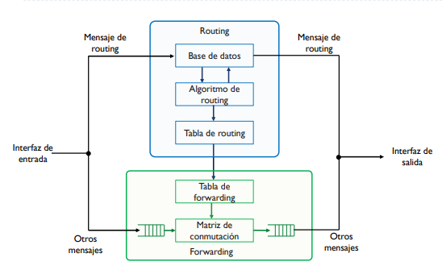

### TEMA 3 Encaminamiento intra-dominio IGP

#### MPLS: MultiProtocol Lable Switching

Es un protocolo para agilizar el proceso de consulta de las tablas de forwarding, dado que estas tablas tienen muchas entradas. Añadiendo MPLS hacemos el protocolo de encaminamiento mejor.

En MPLS se usan etiquetas 'locales' entre parejas de routers para distribuir los prefijos, haciendo que los routers MPLS consulten una tabla de etiquetas de tamaño menor para reenviar paquetes MPLS. Un envio de paquetes con MPLS será:

Se distribuyen las etiquetas dentro del sistema. 

El origen hace IP lookup para hacer *label push* para añadir la cabecera.

Los intermedios hacen *label swap* con su label local en la cabecera.

En el destino, se quita la cabecera MPLS ,*label pop* , y se hace IP lookup para ver el gw.

Las etiquetas se proporcionan en sentido *Upstream* y los paquetes circulan en sentido *Downstream*.

La cabecera MPLS se sitúan entre el paquete IP y el paquete TCP (nivel 2,5) y contiene el tag, un TTL y 1 bit S que indica si hay label stack. 

* Penultimate Hop Hopping (PHP)
* Label Stack

#### MPLS-TE: MPLS Traffic Enginiering

#### MPLS Fast Reroute

